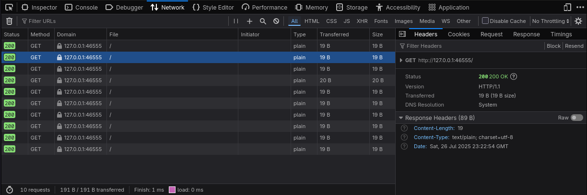

# DayTripper
<div style="text-align:center">
    
</div>

A zero-dependency library for transparently recording HTTP conversations between Go HTTP clients and servers. Works with
most Go libraries that support passing in [http.Client](https://pkg.go.dev/net/http#Client) or 
[http.RoundTripper](https://pkg.go.dev/net/http#RoundTripper).

Recordings can be exported as [HTTP Archives (HAR)](https://en.wikipedia.org/wiki/HAR_(file_format)) which can be viewed
in most browsers.

*Note:* This library is in very early stages of development and shouldn't be considered stable yet. A tagged version
will be released after the API is solidified and test coverage is improved. At this point use at your own risk.

## Features:
 * Record requests and responses from Go applications and libraries using the standard Go HTTP client.
 * Export to Browser compatible HAR files.
 * Low-level timing information is included; you can see how long each component of your request is taking.
 * Tracking the IP address of the server being connected to (serverIPAddress).
 * Page Tracking (see: [examples/multipaged/multipaged.go](examples/multipaged/multipaged.go)).
 * Header Redaction (see [examples/redact/redact.go](examples/redact/redact.go)).

## What's this useful for?
You might find this library useful for the following tasks
* Debugging HTTP client Applications; use for when you need to be able to visualize and inspect applications you're
  writing that are interacting with HTTP servers.
* Understanding how third party libraries are making requests.
* Allowing your application to collect diagnostic information which they can send you to help with bug reporting.

## Installation
```
go get github.com/swedishborgie/daytripper
```
## Example
See [examples/basic/basic.go](examples/basic/basic.go) for the full example.
```go
client := http.DefaultClient

// Create the recorder and pass it the client. It will wrap the http.Transport.
dt, _ := daytripper.New(
    daytripper.WithReceiver(receiver.NewHARFileReceiver("log.har")),
    daytripper.WithClient(client),
)
// Close the recorder before exiting, this flushes the HAR file to disk (you can also call DayTripper.Flush()).
defer dt.Close()

// Make the request as normal.
req, _ := http.NewRequestWithContext(context.Background(), "GET", "https://example.com/", nil)
rsp, _ := client.Do(req)
defer rsp.Body.Close()

body, _ := io.ReadAll(rsp.Body)
```

You can then open the resulting `log.har` file in most browsers (e.g. Chrome / Firefox) by dragging and dropping the
file into the Network Inspector window:
